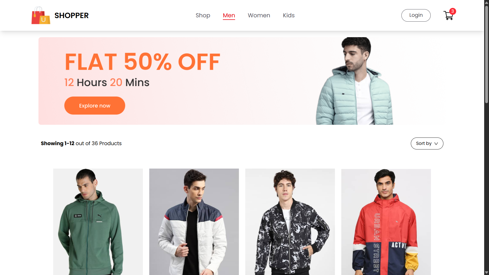

# E-Shopper: A Responsive React E-Commerce Website

A fully-featured, responsive front-end e-commerce application built with modern web technologies.

[**Live Demo:**](https://e-commerce-topaz-omega-69.vercel.app/)

---

## Features

- **Responsive Design:** A mobile-first approach ensures a seamless experience on any device.
- **Product Browse:** Users can view products by categories (Men, Women, Kids).
- **Product Details:** Dedicated page for each product with detailed information.
- **Shopping Cart:** Fully functional cart to add, remove, and view items.
- **Modern UI:** Clean and intuitive user interface built with Tailwind CSS.

---

## Tech Stack

- **Framework:** React 19
- **Routing:** React Router v7
- **State Management:** React Context API
- **Styling:** Tailwind CSS
- **Build Tool:** Vite

---

## Getting Started

To get a local copy up and running, follow these simple steps.

### Prerequisites

You'll need Node.js and npm installed on your machine.

### Installation

1. Clone the repo
   [git clone](https://github.com/Faiz-19/E-Commerce.git)

2. Install NPM packages
  npm install
3. Run the development server
   npm run dev
